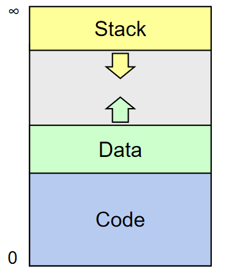
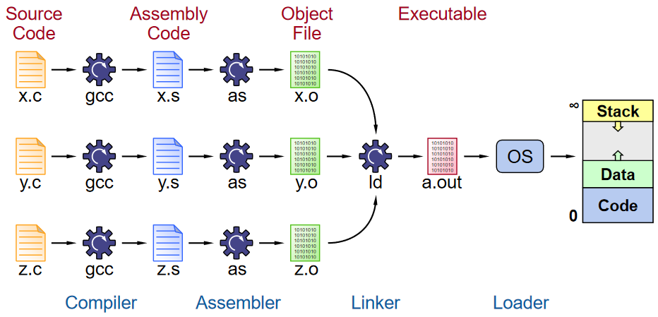

# Linking

## Memory

Process memory layout:

## Process creation

## Linkers
* Unix: `ld`
* Windows: `LINK.exe`

What does it do?
1. Combine object files (compiled from source)
2. Computes memory layout
3. Fix memory addresses
4. Produces executable

Problems it has to deal with:
* Assembler doesn't know where code or data will go in memory
    - Makes a guess: Assume sections will be located at `0`, write everything as such
* Assembler doesn't know addresses of external objects
    - Makes a guess: Assume `0` and leave a note for the linker

## Object file
Contains:
* Code and data sections
    - Size
    - Starting address
    - Initial contents
* Symbol table
    - Name and location for each of the methods and variables
* Unresolved references: info for linker
    - Location of the reference
    - What should the reference point to
* Additional info:
    - Debugging info

## Linking operation
1. Read in section sizes, computes memory layout
2. Reads symbols, build symbol table
3. Read section data, fix addresses, write executable

## Dynamic linking
* Shared libraries, don't know locations at link time

At startup, dynamic loader scans jump table (for example, maps `printf` to `libc.so`)
1. Loads file into memory (`mmap`)
2. Looks up symbols
3. Fills address in jump table