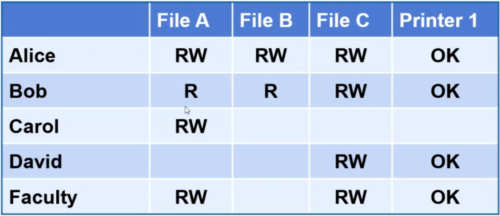

# Protection
* Prevent accidental/intentional misuse

1. Authentication: identify principal
2. Authorization: who may do what
3. Entacement

## Authentication
Passwords: secret info
* Need to be long and secure
* Need lots of them!
* Phishing/social engineering works
* Must protect database: never store pwd in clear
* One-way transforms: given ciphertext, can't compute clear text; different cleartext yields different ciphertext

Key/badge
* No need for secrecy
* If stolen, will know
* Requires physical presence to steal

2-factor authentication
* 1. Password
* 2. Use cellphone as key (site texts or spawns code, enter into site)

For web sites:
* Site downloads cookie
* Browser returns cookie to site

## Authorization
Which principals, which operations, which objects

Access matrix:

### Access control list
* Protection info stored with objects
* For files in Unix/Linux: 9 bits (owner, group, all x read, write, execute)
    - Root can do anything
* Windows has more general permissioning but very complex

### Capability list
* Store auth info with principals
* Can't revoke permissions once assigned
* Also names for objects
* Awkward, but idea lives on:
    - Page tables
    - Google drive
    - Snapchat?

### Access enforcement
* Too much code has total power
* Security kernel: all security components are isolated to the kernel
* Users/processes can only do what is allowed by security kernel

### Rights amplification
* When calling method, callee gets more privilege
* Kernel call
* Set user id (Linux)
    - One extra bit/file
    - Normally, child process inherits parent's user id
    - Exec on suid file? Process user id <- file owner