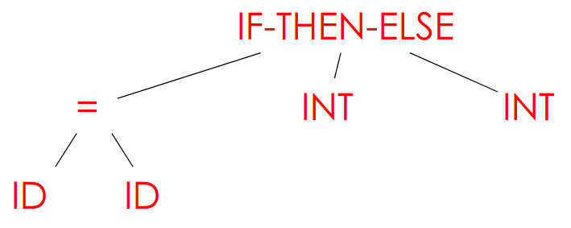
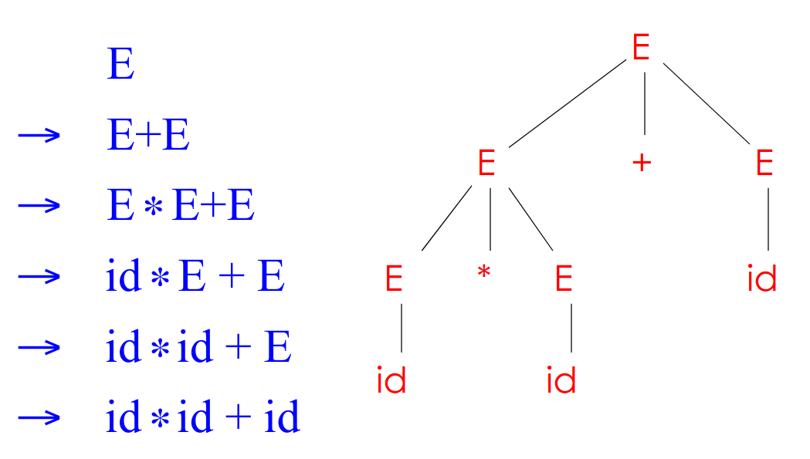
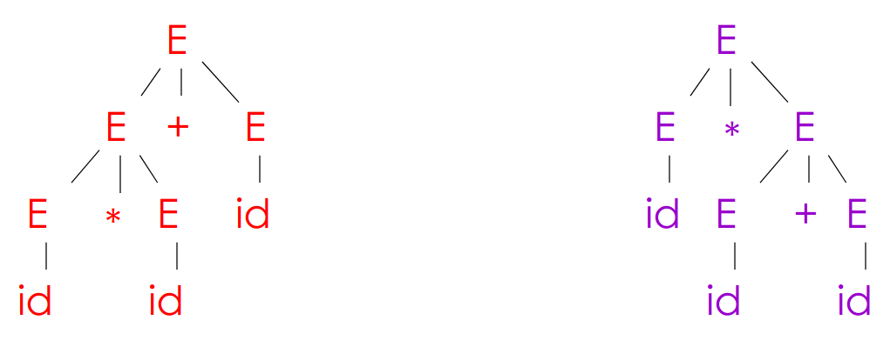

# Parsing

## Parser functionality

* Input: sequence of tokens from lexer
* Output: parse tree of the program (in practice, Abstract Syntax Tree)
* Parser distinguishes between valid and invalid strings of tokens
    - Requires a language for describing valid strings of tokens
    - Requires a method for distinguishing between valid and invalid strings of tokens

e.g.

* COOL syntax: `if x = y then 1 else 2 fi`
* Parser input (Lexer output): `IF ID = ID THEN INT ELSE INT FI`
* Parser output:
    

## Context-Free Grammars

Disadvantages of regular languages:

* Many languages (i.e., balanced parenthesis) are nonregular yet we want to be able to capture them
* A finite automaton that runs long enough must repeat states, but finite automata can't remember the number of times it visited a state

A CFG is a natural notation for recursive structure found in programming language constructs

* e.g. an `EXPR` can be
    - `if EXPR then EXPR else EXPR fi`
    - `while EXPR loop EXPR pool`
* A CFG consists of
    - A set of terminals `T`
    - A set of non-terminals `N`
    - A start symbol `S` (a non-terminal)
    - A set of productions X -> Y<sub>1</sub>Y<sub>2</sub>...Y<sub>n</sub>, where
        - X in N
        - Y<sub>i</sub> in T ∪ N ∪ {ε}
* COOL example:
    ```
    EXPR -> if EXPR then EXPR else EXPR fi
         | while EXPR then EXPR pool
         | id
    ```
* Implementation: Bison

### CFG languages

* Read productions as rules: X -> Y<sub>1</sub>Y<sub>2</sub>...Y<sub>n</sub> means X can be replaced by Y<sub>1</sub>Y<sub>2</sub>...Y<sub>n</sub>
* Key idea:
    1. Begin with a string consisting of the start symbol `S`
    2. Replace non-terminals $X$ in the string by the right-hand side of some production X -> Y<sub>1</sub>Y<sub>2</sub>...Y<sub>n</sub>
    3. Repeat (2) until there are no non-terminals left in the string
* Formally: Let $G$ be a CFG with start symbol $S$. Then the language of $G$ is {a<sub>1</sub>...a<sub>n</sub> | S ->* a<sub>1</sub>...a<sub>n</sub> and every a<sub>i</sub> is a terminal}
* Terminals are so-called because there are no rules for replacing them: once generated, they are permanent
    - Terminals should be tokens of the language
* Example: strings of balanced parantheses
    - S -> (S), S -> ε
* Example: arithmetic expressions
    - E -> E+E | E*E | (E) | id

## Derivations and parse trees

* A derivation is a sequence of productions leading to a string of only terminals: s -> ... d -> ...
* A derivation can be drawn as a tree
    - Start symbol is a tree's root
    - For a production X -> Y<sub>1</sub>Y<sub>2</sub>...Y<sub>n</sub> add children X -> Y<sub>1</sub>Y<sub>2</sub>...Y<sub>n</sub> to node X
* Example:
    
* Notes:
    - A parse tree has terminals at the leaves, non-terminals at the inner nodes
    - An in-order traversal of the leaves is the original inputs
    - The parse tree shows the association of operations, the input string does not
    - Can do derivations in left-most order (replace left-most non-terminal at each step) or right-most order; these yield equivalent parse trees

### Ambiguity

* A CFG is ambiguous if it has more than one parse tree for some string
    - Leaves meaning of some programs ill-defined
* Example:
    - Grammar E -> E+E | E*E | (E) | id
    - String id * id + id
    - Yields following parse trees:
        
* To deal with ambiguity, most direct method is to rewrite grammar unambiguously
    - E -> E' + E | E'
    - E -> id * E' | id | (E) * E' | (E)
    - Enforces precedence of multiplication over addition
* Tools now can allow precedence and associativity declarations to allow one to write natural ambiguous grammar and then disambiguate later