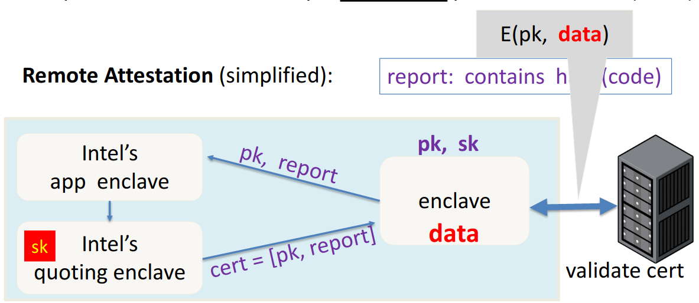
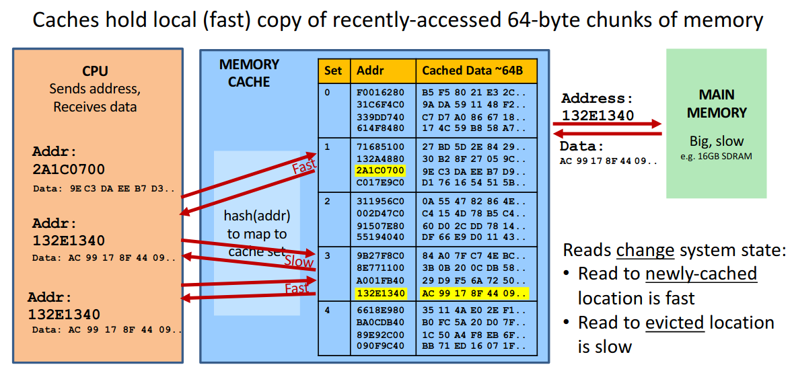

# Processor security

## The processor

* Part of the trusted computing base (TCB) 
    - But is optimized for performance
    - Security may be secondary
* Processor design and security:
    - Important security features
        - Hardware enclaves
        - Memory encryption (TME)
        - RDRAND
        - etc.
    - Some features can be exploited for attacks 
        - Speculative execution
        - Transactional memory

## Intel Software Guard eXstensions (SGX)

* Extension to Intel processors that support
    - Enclaves: running code and memory isolated from rest of system
    - Attestation: prove to local/remote system what code is running in enclave
    - Minimum TCB: only processor is trusted and nothing else
        - DRAM and peripherals are untrusted
        - Writes to memory are encrypted
* Applications
    - Storing a web server HTTPS secret key: secret key only opened inside an enclave
        - Malware cannot get the key
        - Note: this is different from TPM2 - TPM2 only provides secure storage at boot, after that it's all in memory
    - Running a private job in the cloud: job runs in enclave
        - Cloud admin cannot get code or data or job
    - Client side: hide antivirus signatures
        - AV signatures are only opened inside an enclave
    - Data science on federated data
        - Compute on shared data, without ever having to share the data with anyone else
    - SGX now deprecated in consumer CPUs, only available in server CPUs

### SGX enclaves

* Application defines part of itself as an enclave
* Untrusted part of memory creates enclave
* Enclave is isolated memory in process memory space
    - Inaccessible while processor is not in SGX mode
* Untrusted part can call a trusted function in the enclave
    - To do execution, processor goes into SGX mode
* Creating en enclave:
    - `ECREATE`: establish mem addr for enclave
    - `EADD`: copy memory pages into enclave
    - `EEXTEND`: compute hash of enclave contents, 256 bytes at a time
    - `EINIT`: verifies that hashed content is properly signed; if so, initializes enclave (signature: RSA3072)
    - `EENTER`: call function inside enclave
    - `EEXIT`: return from enclave


### SGX attestation

* Problem: enclave memory is in the clear prior to activation (`EINIT`)
* How to get secrets into enclave?



### SGX insecurity

* Side channels: attacker controls the OS, OS sees lots of side-channel info
    - Memory access patterns
    - State of processor caches as enclave executes
    - State of branch predictor
* Extract quoting key
    - Attestation: proves to 3rd party what code is running in enclave
        - Quoting sk stored in Intel enclave on untrusted machines
    - What if attacker extracts sk from *some* quoting enclave?
        - Can attest to arbitrary non-enclave code

## The Spectre attack

### Background

* CPU optimizations
    - Clock speed maxed out: Pentium 4 (2004) reached 3.8 GHz
    - Memory latency is slow and not improving much
    - To gain CPU performance, need to do more per cycle
        - Reduce memory delays: caches
        - Work during delays: speculative execution
* Memory caches
    - Hold local (fast) copy of recently-addressed 64-byte chunks of memory
    
* Speculative execution
    - At a branch: CPU will guess that the code will go in one direction and start executing that code while waiting for branch result
    - When result comes back, if it is wrong direction, throw away the work and start executing that direction
* Mitigations to the below attacks are still an active area of research
* Other speculative execution attacks also exist (e.g. Meltdown)

### Conditional branch (Variant 1) attack

e.g.

```c
if (x < array1_size)
    y = array2[array1[x] * 4096];
```

* Suppose memory at `array1` base is 8 bytes of data that doesn't matter
    - Memory at `array1` base + 1000: something secret
* Suppose `unsigned int x` comes from untrusted caller
* Execution without speculation is safe:
    `array2[array1[x]*4096]` is not evaluated unless `x < array1_size`
* Before attack:
    - Train branch predictor to expect `if()` is true: e.g. call with `x < array1_size`
    - Evict `array1_size` and `array2[]` from cache
* Attacker calls victim with `x = 1000`
* Speculative exec while waiting for `array1_size`:
    - Predict that `if()` is true
    - Read address (`array1` base + x)
        - Using out-of-bounds `x=1000`
    - Read returns secret byte (in cache - fast)
    - Brings `array2[BYTE * 4096]` brought into the cache
    - CPU realizes `if()` is false, discards speculative work
        - But leaves `BYTE` in the cache
* Attacker (another process or core):
    - `for i = 0...255`: measure read time for `array2[i * 4096]`
    - When `i = BYTE` read is fast (cached), this reveals the secret `BYTE`
* Mitigation: speculation stopping instruction (e.g. `LFENCE`)
    - Idea: insert `LFENCE` on *all* vulnerable code paths
    - Need to do so in a non-manual way that does not compromise performance
    - Insertion by smart compiler: supported in LLVM
        - Requires compiler to be aware of specific CPU designs

### Indirect branch (Variant 2) attack

* Indirect branches: can go anywhere, e.g. `jmp [rax]`
    - If destination is delayed, CPU guesses and proceeds speculatively
    - Find an indirect `jmp` with an attacker controlled register
        - Then cause mispredict to a useful gadget
* Attack steps:
    - Mistrain branch prediction so spec-ex will go to gadget
    - Evict address `[rax]` from cache to cause spec-ex
    - Execute victim so it spec-runs gadget
    - Detect change in cache state to determine memory data